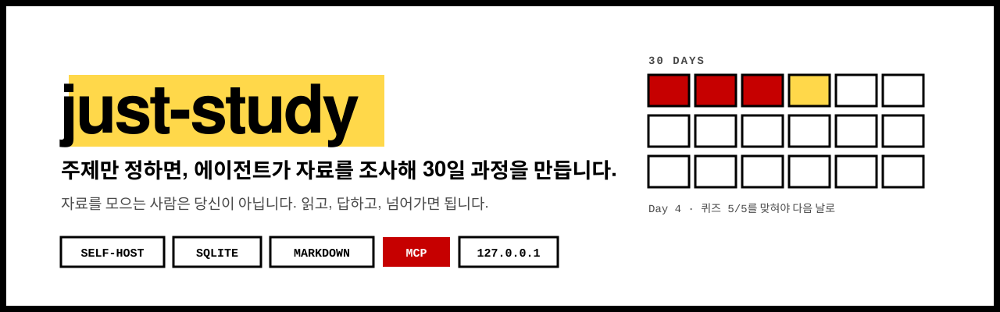
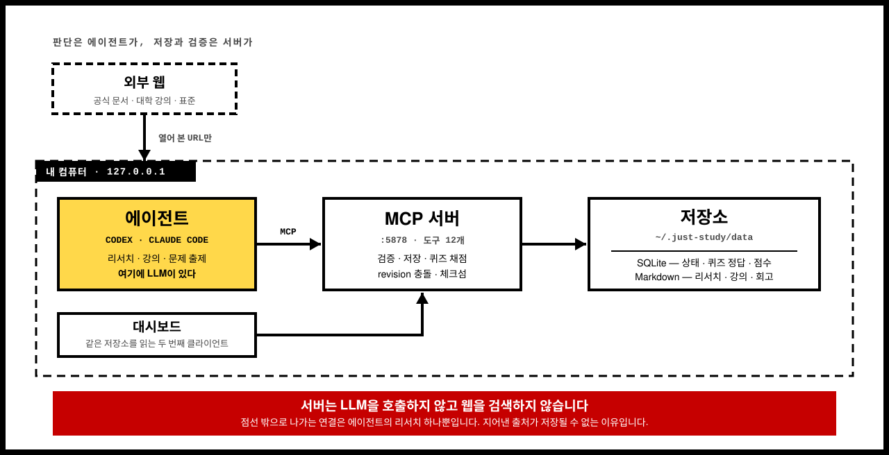
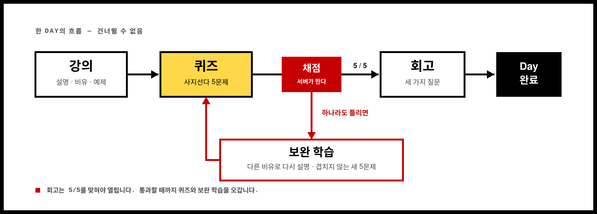
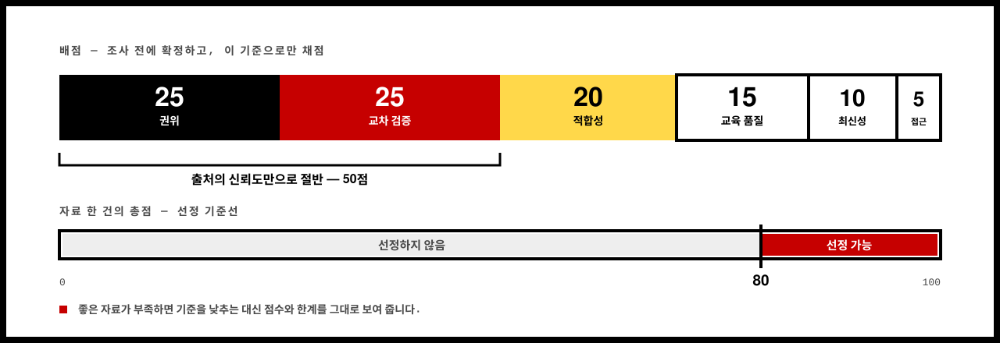

<p align="center">
  
</p>

<p align="center">
  
  
  
  
  
</p>

<p align="center">
  <strong>주제만 정하세요. 자료 조사는 에이전트가 합니다.</strong><br>
  내 컴퓨터에서만 도는 30일 학습 과정 생성기.
</p>

---

## 무엇을 하는 물건인가

공부를 시작할 때 제일 오래 걸리는 건 공부가 아닙니다. **어디서부터 볼지 정하는 일**입니다.

`just-study`는 그 앞단을 대신합니다. "운영체제를 공부하고 싶다"고 말하면 에이전트가 실제로 웹을 뒤져 자료를 모읍니다. 고정된 100점 루브릭으로 채점하고 주요 주장을 서로 다른 출처로 교차 검증한 다음, 하루에 목표 하나씩인 **30일 목차**를 만들어 승인을 요청합니다.

승인하면 그때부터 매일 가르칩니다. 설명하고 비유하고 예제를 풀고, 이해했는지 물은 뒤 퀴즈를 냅니다. 틀리면 다른 방식으로 다시 설명합니다.

> 자료를 직접 올려서 관리하는 학습 대시보드와는 방향이 반대입니다.
> 여기서는 **당신이 자료를 준비하지 않습니다.**

<p align="center">
  
</p>

판단하는 쪽과 저장하는 쪽이 갈려 있습니다. 리서치도 강의도 출제도 전부 에이전트가 하고, 서버는 그 결과를 검증해서 넣어 두기만 합니다. **서버에는 LLM이 없습니다.** 그래서 "좋은 자료 찾아줘"에 그럴듯한 URL이 딸려 오는 문제를 규칙으로 막을 수 있습니다.

<!-- 스크린샷을 docs/images/ 에 넣은 뒤 아래 주석을 풀어 주세요.
<p align="center">
  
</p>
-->

## 어떻게 쓰나

```bash
git clone https://github.com/jcmaker/just-study.git
cd just-study
npm install
npm run dev
```

브라우저에서 <http://127.0.0.1:5878>을 엽니다. 그다음 이 저장소에서 연 Codex 세션에 이렇게 입력합니다. Claude Code에서는 `/just-study`입니다.

```
$just-study
```

에이전트가 세 가지를 묻습니다. 이미 아는 게 무엇인지, 30일 뒤에 무엇을 할 줄 알고 싶은지, 예제·이론·실습 중 무엇이 편한지. 답하고 나면 조사가 시작됩니다.

이어서 할 때는 이렇게 씁니다.

```
$just-study 계속
```

<!-- 사용 장면 GIF를 넣은 뒤 아래 주석을 풀어 주세요.
<p align="center">
  
</p>
-->

## 하루가 어떻게 흘러가나

한 Day는 정해진 순서로만 움직입니다. 건너뛸 수 없습니다.

<p align="center">
  
</p>

직선이 아닙니다. **회고는 5/5를 맞혀야 열립니다.** 통과할 때까지 퀴즈와 보완 학습 사이를 돕니다.

| 단계 | 하는 일 |
|---|---|
| **강의** | 오늘 목표에 필요한 자료를 그날 다시 조사합니다. 정확한 설명, ELI5, 비유, 예제, 적용 순으로 가르치고 중간중간 이해를 확인합니다. |
| **퀴즈** | 사지선다 다섯 문제. **채점은 서버가 합니다.** 저장된 정답과 고른 답을 비교하므로 에이전트가 결과를 조작할 수 없고 웹에서 풀든 Codex에서 풀든 결과가 같습니다. |
| **보완 학습** | 하나라도 틀리면 여기로 옵니다. 틀린 개념을 다른 비유와 새 예제로 다시 설명하고 이전 문제를 반복하지 않는 새 다섯 문제를 냅니다. |
| **회고** | 5/5를 맞혀야 열립니다. 오늘 배운 것, 아직 헷갈리는 것, 한 줄 소감을 적으면 학습 기록에 남고 다음 Day로 넘어갑니다. |

30일은 달력상 연속 30일이 아니라 **순서대로 완료하는 30회**입니다. 하루 쉬어도 밀리지 않고 다음날 두 개를 몰아서 하지도 않습니다.

## 자료를 믿을 수 있는 이유

에이전트에게 "좋은 자료 찾아줘"라고 하면 그럴듯한 URL을 지어내는 일이 생깁니다. 이 프로젝트는 규칙으로 그걸 막습니다.

**고정 루브릭 100점.** 조사 전에 기준을 먼저 적고 그 기준으로만 채점합니다.

<p align="center">
  
</p>

배점이 어디에 쏠려 있는지가 이 프로젝트의 입장입니다. **권위와 교차 검증만으로 절반**입니다. 잘 쓰인 글보다 출처를 믿을 수 있는지를 먼저 봅니다.

| 평가 기준 | 배점 |
|---|---:|
| 저자·기관의 권위와 근거 수준 | 25 |
| 독립 자료와의 교차 검증 | 25 |
| 목표와 현재 학습 단계 적합성 | 20 |
| 설명력·예제 등 교육 품질 | 15 |
| 최신성과 유지관리 상태 | 10 |
| 무료 접근성 | 5 |

**80점 미만은 선정하지 않습니다.** 좋은 자료가 부족하면 기준을 몰래 낮추는 대신 점수와 한계를 그대로 보여 줍니다.

**주요 주장은 독립 출처 두 개 이상으로 뒷받침해야 합니다.** 하나뿐이면 주요 주장에서 내리고 불확실성을 기록합니다.

**열어 보지 않은 URL은 저장할 수 없습니다.** 서버는 스스로 웹을 검색하지 않습니다. 에이전트가 실제로 연 주소만 넘어옵니다.

## 지금 어디까지 왔나

정직하게 적습니다. 아직 완성된 제품이 아닙니다.

| 영역 | 상태 |
|---|---|
| 과정 생성·30일 목차·리서치 검증 | 동작 |
| 일일 학습·퀴즈·보완·회고 | 동작 |
| 웹 대시보드 (다섯 화면, 다섯 테마) | 동작 |
| MCP 서버 (도구 12개) | 동작 |
| **실제 Codex CLI 완주 검증** | **아직 수행하지 못했습니다** |
| 일정·과제·PDF·첨부파일 | 다음 단계 |
| Docker 배포·백업·복구 | 다음 단계 |

자동화 테스트는 MCP 클라이언트로 30일 전 과정을 통과하지만, 실제 Codex CLI로 처음부터 끝까지 돌려 본 기록은 아직 없습니다. 그 검증을 마치면 이 줄이 사라집니다.

## 대시보드

`npm run dev` 뒤 브라우저에서 <http://127.0.0.1:5878>을 엽니다. 로그인·가입·계정이 없고 서버는 `127.0.0.1`에만 바인딩합니다.

| 경로 | 화면 | 주요 행동 |
|---|---|---|
| `/` | 오늘 | 이어갈 과정 확인, `$just-study 계속` 명령 복사 |
| `/courses` | 과정 | 상태 필터, 새 과정 만들기 |
| `/courses/[id]` | 과정 작업 공간 | 개요·30일 계획·오늘·출처·퀴즈·학습 기록 탭 |
| `/settings` | 설정 | 테마 선택, 시스템 상태 진입 |
| `/status` | 상태 | 데이터베이스·저장소 점검과 복구 안내 |

### 테마

Focus(기본), Calm, Focus Dark, Bubblegum, Terminal 다섯 가지를 제공합니다. Focus Dark와 Terminal은 어두운 테마입니다. Terminal은 화면 전체가 고정폭 글꼴입니다. 선택값은 이 브라우저의 `localStorage` 키 `just-study:theme`에만 저장되며 학습 데이터에는 영향을 주지 않습니다. 저장값을 읽지 못하면 Focus로 표시합니다.

다섯 테마는 같은 컴포넌트를 쓰고 CSS 변수만 바꿉니다. 테마마다 화면을 따로 만들지 않습니다.

<!-- 테마 비교 스크린샷을 넣은 뒤 아래 주석을 풀어 주세요.
<p align="center">
  
</p>
-->

### 대시보드에서 바꿀 수 있는 것

대시보드는 학습을 대신 진행하지 않습니다. 리서치와 강의는 Codex의 `$just-study`가 하고 화면은 저장된 사실을 읽어서 보여 줍니다. 직접 수정할 수 있는 값은 다음 다섯 가지뿐입니다.

1. 새 과정 만들기
2. 초안 과정의 제목과 목표
3. 아직 답하지 않은 퀴즈 문항의 보기 선택
4. 아직 제출하지 않은 세 개의 회고 답변
5. 테마 선택

퀴즈 정답은 답하기 전까지 브라우저로 전송되지 않습니다. 다른 탭을 열어 미리 볼 수 없습니다.

승인된 30일 목차, 출처 점수, 퀴즈 문제와 채점 결과, 완료된 Day는 읽기 전용입니다. 다른 곳에서 과정이 먼저 저장되면 저장을 거부합니다. 입력한 내용은 그대로 둔 채 최신 상태를 다시 불러오도록 안내합니다. 체크섬 검증에 실패한 문서는 정상 내용처럼 표시하지 않고 `/status` 복구 안내로 연결합니다.

## 에이전트 연결

MCP 엔드포인트는 서버가 떠 있는 동안에만 열립니다. Codex는 `.codex/config.toml`에서 연결 정보를 읽습니다.

```toml
[mcp_servers.just-study]
url = "http://127.0.0.1:5878/mcp"
required = false
default_tools_approval_mode = "writes"
```

Claude Code는 같은 엔드포인트를 저장소의 `.mcp.json`에서 읽습니다. 세션을 처음 열 때 이 서버를 신뢰할지 한 번 물어봅니다.

저장소 밖에서도 쓰고 싶으면 플러그인으로 설치합니다. 스킬과 MCP 설정이 함께 따라와서 어느 디렉터리에서든 `/just-study`를 부를 수 있습니다.

```
/plugin marketplace add jcmaker/just-study
/plugin install just-study@just-study
```

서버는 `/just-study`를 부를 때 에이전트가 직접 띄웁니다. 직접 `npm run dev`를 실행해 둘 필요는 없습니다. 다만 서버가 꺼진 채로 세션이 시작됐다면 MCP 클라이언트가 그 세션에서는 다시 붙지 않으므로, 첫 회에 한 번 세션을 새로 열어야 합니다.

스킬 파일은 `.agents/skills/just-study/SKILL.md` 한 벌뿐입니다. Claude Code가 읽는 `.claude/skills/just-study/SKILL.md`는 이 파일을 가리키는 심링크라 두 에이전트가 항상 같은 규칙을 따릅니다. 리서치·강의·채점 판단은 전부 스킬이 하고 서버는 저장과 검증만 맡습니다.

`$just-study`(Claude Code에서는 `/just-study`)를 부르면 먼저 같은 주제의 과정이 있는지 확인하고 이어갈지 새로 만들지 묻습니다. `$just-study 계속`은 저장된 과정을 재개하며, 여러 개면 어느 것인지 물어봅니다.

### MCP 도구

| 도구 | 종류 | 하는 일 |
|---|---|---|
| `health` | 읽기 | 데이터베이스·저장소·스키마·복구 상태를 점검합니다. |
| `list_courses` | 읽기 | 저장된 과정과 각각의 Day·단계·revision을 나열합니다. |
| `get_learning_state` | 읽기 | 현재 Day, 단계, 리서치, 개념, 퀴즈와 오늘 문서를 읽습니다. |
| `read_learning_document` | 읽기 | 체크섬이 검증된 문서 하나를 읽습니다. |
| `create_course` | 쓰기 | 요청 UUID로 초안 과정을 멱등하게 만듭니다. |
| `approve_outline` | 쓰기 | 인터뷰·리서치·지식 지도·30개 목표를 승인받은 뒤 초안을 활성화합니다. |
| `record_daily_research` | 쓰기 | 그날 실제로 조사한 출처와 교차 검증 주장을 저장합니다. |
| `save_checkpoint` | 쓰기 | 실제로 가르친 내용과 개념 상태를 저장합니다. |
| `start_quiz` | 쓰기 | 답을 보기 전에 확정한 다섯 문제를 저장합니다. |
| `answer_quiz` | 쓰기 | 학습자가 고른 보기 번호를 저장합니다. 정답 판정은 서버가 합니다. |
| `start_remediation_quiz` | 쓰기 | 다른 설명과 새 다섯 문제를 저장합니다. |
| `complete_day` | 쓰기 | 세 개의 회고를 저장하고 다음 Day로 넘깁니다. |

## 데이터가 어디에 저장되나

모든 영구 데이터는 `~/.just-study/data/` 아래에 있습니다. 실행 디렉터리와 무관한 고정 위치라, 저장소에서 띄우든 플러그인 설치본에서 띄우든 같은 곳을 봅니다.

```
~/.just-study/data/
├── just-study.sqlite              구조화 상태
└── courses/<course-id>/
    ├── course.md                  리서치 본문, 지식 지도, 30일 목차
    ├── progress.md                SQLite에서 생성한 읽기 전용 스냅샷
    ├── journal.md                 완료한 Day의 강의와 회고
    └── current-day.md             진행 중인 Day (Day 30을 마치면 사라집니다)
```

**SQLite가 기준입니다.** 과정 상태, 현재 Day와 단계, 퀴즈 결과, 출처 점수는 여기 있습니다. **Markdown은 긴 글의 기준입니다.** 리서치 본문, 강의 내용, 회고가 여기 있습니다. SQLite는 Markdown 경로와 체크섬을 함께 저장하므로 파일이 손상되면 정상 내용인 척 보여 주지 않고 복구 화면으로 안내합니다.

다른 위치를 쓰려면 `JUST_STUDY_DATA_DIR`를 지정하세요.

WAL 모드로 도는 중에 `just-study.sqlite` 하나만 복사하면 안 됩니다. 실행 중 안전한 백업은 다음 단계에서 다룹니다. 지금은 앱을 멈추고 `~/.just-study/data/` 디렉터리 전체를 복사하세요.

## 개발

```bash
npm test          # Node 표준 테스트 러너, 267개
npm run lint
npx tsc --noEmit
npm run build
```

의존성을 최소로 유지합니다. ORM, 상태 관리 라이브러리, 테스트 프레임워크, 차트 라이브러리, 날짜 라이브러리를 쓰지 않습니다. 원격 폰트도 내려받지 않습니다.

### 의존성 override에 관해

`package.json`에 `overrides`가 두 줄 있습니다.

```json
"overrides": {
  "postcss": "^8.5.25",
  "sharp": "^0.35.3"
}
```

`next`는 `postcss`를 `8.4.31`로 정확히 고정하고 `sharp`를 선택적 의존성으로 받는데, 두 버전 모두 보안 권고가 붙어 있습니다. 이 override는 그 두 전이 의존성만 올립니다. `npm audit` 결과는 0건입니다.

**`npm audit fix --force`를 실행하지 마세요.** `next`를 `9.3.3`으로 되돌리라고 제안합니다. 몇 년 된 버전이며 이 프로젝트는 `next` 16을 최신으로 유지합니다. 취약점은 `next` 자체가 아니라 전이 의존성에 있었고 위 override로 해결했습니다.

참고로 이 앱은 `next/image`를 쓰지 않아 `sharp` 경로가 실행되지 않습니다.

설계 문서와 구현 계획은 `docs/superpowers/` 아래에 있습니다. 변경으로 계약이 달라진 곳은 원문을 지우지 않고 정정 기록을 덧붙였습니다.

## 이 프로젝트가 하지 않는 것

- 서버가 직접 LLM을 호출하거나 웹을 검색하는 일
- 로그인·가입·계정·다중 사용자
- 외부 네트워크 공개 (`127.0.0.1` 고정)
- 클라우드 SaaS, 결제
- 알림, 연속 학습 표시, 배지 같은 게임화

수요가 확인되기 전에는 이런 기능에 쓸 데이터 모델이나 추상화를 미리 만들지 않습니다.

## 참고

self-host 운영 방식과 학습 관리 기능이 어떤 모습인지 보려고 [OpenStudy](https://github.com/OpenStudy-dev/OpenStudy)를 참고 자료로 살펴봤습니다. `just-study`는 독립 제품이며 코드를 재사용하지 않았습니다.

## 라이선스

[MIT](LICENSE).

`package.json`의 `"private": true`는 npm 레지스트리 publish를 막는 설정이며 소스 공개나 라이선스와는 무관합니다. 이 프로젝트는 npm 패키지가 아니라 직접 띄워 쓰는 앱입니다.
